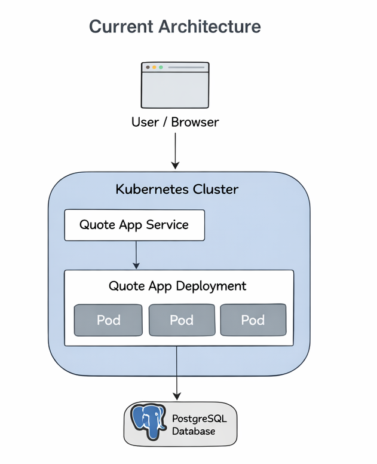

# architecture-notes.md

## Lab 85 – Architecture et Production Kubernetes


# Diagramme d’architecture actuel

Voir le diagramme :



Ce diagramme représente :

* Utilisateur / Navigateur
* Cluster Kubernetes
* Service
* Deployment
* Pods
* Base PostgreSQL


# Où se fait l’isolation ?

L’isolation se fait à plusieurs niveaux :

* Les conteneurs isolent les processus
* Les Pods isolent les applications
* Les Nodes isolent les ressources
* La machine virtuelle isole Kubernetes du système physique


# Qu’est-ce qui redémarre automatiquement ?

Les éléments qui redémarrent automatiquement :

* Les conteneurs redémarrent en cas de crash
* Les Pods sont recréés si supprimés
* Le Deployment maintient le nombre de replicas


# Ce que Kubernetes ne gère pas

Kubernetes ne gère pas :

* La machine virtuelle
* Le système d’exploitation
* Le matériel
* Le réseau physique
* Le stockage physique


# Comparaison Conteneurs vs Machines Virtuelles

| Caractéristique | Conteneurs        | Machines Virtuelles |
| --------------- | ----------------- | ------------------- |
| Kernel          | Partagé           | Séparé              |
| Démarrage       | Quelques secondes | Plusieurs minutes   |
| Ressources      | Faibles           | Élevées             |
| Isolation       | Moyenne           | Forte               |
| Complexité      | Simple            | Complexe            |


# Quand préférer une VM ?

On préfère une machine virtuelle lorsque :

* Une forte isolation est nécessaire
* Plusieurs systèmes d’exploitation sont nécessaires
* Il existe des contraintes de sécurité
* Applications anciennes (legacy)


# Quand combiner VM et conteneurs ?

On combine VM et conteneurs lorsque :

* Kubernetes tourne dans des VM
* En cloud public
* Pour améliorer la sécurité


# Scalabilité Horizontale

Commande utilisée :

```
kubectl scale deployment quote-app --replicas=3
```


# Ce qui change lors du scaling

* Plus de Pods sont créés
* Le trafic est réparti
* La disponibilité augmente


# Ce qui ne change pas

* L’adresse IP du Service
* La base de données
* Le fonctionnement de l’application


# Simulation de panne

Commande :

```
kubectl delete pod quote-app-xxxxx
```


# Qui a recréé le Pod ?

Le Deployment a recréé le Pod.


# Pourquoi ?

Le Deployment maintient l’état désiré.

Si 3 Pods sont demandés, Kubernetes en recrée automatiquement.


# Que se passe-t-il si un node tombe ?

Si un node tombe :

* Les Pods sont recréés sur un autre node
* Il peut y avoir une coupure temporaire


# Requests vs Limits

```
resources:
  requests:
    cpu: "100m"
    memory: "128Mi"
  limits:
    cpu: "250m"
    memory: "256Mi"
```


# Requests

Les requests représentent :

* Les ressources minimum garanties


# Limits

Les limits représentent :

* Les ressources maximum autorisées


# Pourquoi c’est important

Cela permet :

* D’éviter qu’un Pod consomme toutes les ressources
* D’assurer la stabilité
* De partager le cluster entre plusieurs applications


# Readiness vs Liveness

## Liveness Probe

La liveness probe vérifie :

Si l’application est vivante.

Si elle échoue :

→ Le conteneur redémarre


## Readiness Probe

La readiness probe vérifie :

Si l’application est prête à recevoir du trafic.

Si elle échoue :

→ Le Pod ne reçoit plus de trafic.


# Importance en production

Cela permet :

* D’éviter d’envoyer du trafic vers un Pod cassé
* D’améliorer la disponibilité
* De réduire les erreurs utilisateurs


# Kubernetes et Virtualisation


# Qu’est-ce qui tourne sous k3s ?

Sous k3s on trouve :

* Linux
* Machine virtuelle
* Container runtime


# Kubernetes remplace-t-il la virtualisation ?

Non.

Kubernetes utilise la virtualisation.

VM → infrastructure
Kubernetes → orchestration


# Data Center Cloud

Architecture typique :

Hardware
→ Hyperviseur
→ Machines virtuelles
→ Kubernetes
→ Pods


# Système embarqué automobile

Architecture possible :

Hardware ECU
→ Linux
→ Kubernetes léger
→ Conteneurs


# Institution financière

Architecture typique :

Serveurs physiques
→ Hyperviseur
→ Machines virtuelles sécurisées
→ Kubernetes
→ Applications


# Architecture de production


# Cluster

Cluster avec 4 nodes :

* 1 node PostgreSQL
* 3 nodes application


# Persistance

PostgreSQL utilise :

* Persistent Volume
* Persistent Volume Claim


# Sauvegardes

Sauvegardes quotidiennes :

```
pg_dump
```

Stockées :

* NAS
* Cloud


# Monitoring

Outils possibles :

* Prometheus
* Grafana

Permet de surveiller :

* CPU
* RAM
* Pods


# Logs

Logs centralisés :

* Elasticsearch
* Fluentd
* Kibana


# CI/CD

Pipeline :

GitHub
→ Docker Build
→ Registry
→ Kubernetes


# Ce qui tourne dans Kubernetes

* quote-app
* PostgreSQL
* Monitoring


# Ce qui tourne dans les VM

* Nodes Kubernetes
* Linux


# Ce qui tourne hors cluster

* GitHub
* Registry Docker
* Sauvegardes


# Panne contrôlée

Erreur introduite :

[text](architecture-notes.md)


# Evénements Kubernetes

Exemple :

```
Failed to pull image
ImagePullBackOff
```


# Analyse

Première erreur :

Impossible de télécharger l’image.

Signal le plus rapide :

```
kubectl get pods
```


# Configuration avec Secret

Création :

```
kubectl create secret generic quote-db-secret \
--from-literal=POSTGRES_USER=quote \
--from-literal=POSTGRES_PASSWORD=quote
```


# Pourquoi les Secrets sont meilleurs

Les Secrets :

* Évitent les mots de passe en clair
* Séparent config et code
* Plus sécurisé


# Les Secrets sont-ils chiffrés ?

Par défaut :

* Encodés Base64 seulement

Stockés dans :

* etcd

Chiffrés uniquement si activé.


# Rollout contrôlé

Images :

```
quote-app:v1
quote-app:v2
```

Commandes :

```
kubectl rollout status deployment quote-app

kubectl rollout history deployment quote-app
```


# Ce qui change pendant le rollout

* Les Pods sont remplacés progressivement


# Ce qui ne change pas

* Service
* IP
* Base de données


# Rollout cassé

Erreur :

Image inexistante.


# Première erreur visible

Pods en état :

```
ImagePullBackOff
```


# Rollback

Commande :

```
kubectl rollout undo deployment quote-app
```


# Effet du rollback

Changé :

* Pods restaurés

Non changé :

* Base de données
* Service


# Rolling Update Strategy

```
strategy:
  type: RollingUpdate
  rollingUpdate:
    maxSurge: 1
    maxUnavailable: 0
```


# maxSurge

Nombre de Pods supplémentaires pendant la mise à jour.


# maxUnavailable

Nombre de Pods pouvant être indisponibles.


# Pourquoi maxUnavailable = 0

Permet :

* Zéro interruption de service


# Critique de l’architecture

## Points faibles

* Une seule base PostgreSQL
* Une seule VM


## Risques

* Crash VM
* Perte disque


## Sécurité

* Pas de NetworkPolicy
* Secrets non chiffrés


## Monitoring

* Monitoring incomplet
