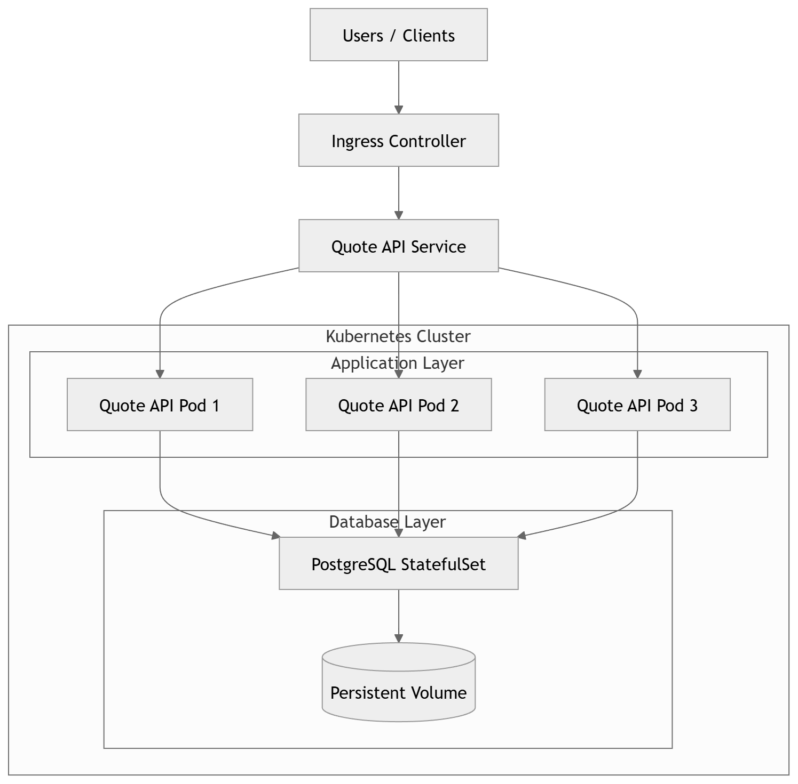

# Final Architecture – Quote API

## Current System Problems

### 1. Application and Database in the Same Container

**Problem**

The Quote API and the PostgreSQL database are running inside the same container and inside a single Pod.

**Why it matters**

Application services and databases should be separated. Databases require persistent storage and different scaling strategies compared to application servers.

**Risk**

If the pod crashes or is redeployed, the database will also restart and data may be lost.  
It also prevents scaling the application independently from the database.

### 2. No Persistent Storage

**Problem**

The PostgreSQL database is running without persistent storage.

**Why it matters**

Production databases must store data on persistent volumes so that the data survives pod restarts or rescheduling.

**Risk**

If the pod is deleted, restarted, or moved to another node, all stored data will be lost.

### 3. No Liveness or Readiness Probes

**Problem**

The application has no health checks configured.

**Why it matters**

Kubernetes needs probes to know when an application is ready to receive traffic and when it has become unhealthy.

**Risk**

Traffic may be sent to a pod that has not finished starting or that is stuck.  
Failures may go undetected and the pod may never be restarted.

### 4. Secrets Stored in Plaintext Environment Variables

**Problem**

Database credentials are stored directly in the deployment manifest.

**Why it matters**

Sensitive data such as passwords should be stored in Kubernetes Secrets.

**Risk**

Credentials could be exposed through the repository or logs, creating a major security vulnerability.

### 5. No Resource Limits

**Problem**

The container does not define CPU or memory limits.

**Why it matters**

Resource limits prevent a container from consuming excessive resources and affecting other workloads.

**Risk**

A runaway process could consume all available CPU or memory and destabilize the node.

### 6. Single Pod Deployment

**Problem**

The application runs with only one pod.

**Why it matters**

A single pod creates a single point of failure.

**Risk**

If the pod crashes, the entire service becomes unavailable until Kubernetes recreates it.

### 7. Single Node Dependency

**Problem**

The system runs on a single Kubernetes node.

**Why it matters**

Production systems must tolerate node failures.

**Risk**

If the node crashes or becomes unreachable, the entire service goes offline.

# Production Architecture

The improved architecture separates the application and database and introduces high availability, persistence, and operational safety.

Key improvements:

- Application deployed using a **Deployment with multiple replicas**
- PostgreSQL deployed using a **StatefulSet with persistent volumes**
- Secrets stored using **Kubernetes Secrets**
- Health monitoring using **readiness and liveness probes**
- Resource limits for stability
- Rolling updates for safe deployments
- Kubernetes Services for internal communication

Architecture diagram:

### Components

**Ingress**

Receives external HTTP traffic and routes it to the application service.

**Service (ClusterIP)**

Provides stable networking for application pods.

**Quote API Deployment**

- 3 replicas
- rolling update strategy
- liveness and readiness probes
- CPU and memory limits

**PostgreSQL StatefulSet**

- persistent volume claim
- stable network identity
- single replica database

**Persistent Volume**

Stores database data so that it survives pod restarts.

**Secrets**

Stores database credentials securely.

# Operational Strategy

### Scaling

The system scales horizontally by increasing the number of application pods.

Kubernetes automatically distributes traffic between replicas using the Service load balancing.

If traffic increases, the Deployment replica count can be increased manually or automatically using a Horizontal Pod Autoscaler.

### Safe Updates

Updates are deployed using a **RollingUpdate strategy**.

Pods are replaced gradually instead of all at once.  
This ensures that some instances remain available during deployments.

If a new version fails readiness checks, Kubernetes will stop the rollout.

### Failure Detection

Failures are detected using:

**Readiness probes**

Ensure that only healthy pods receive traffic.

**Liveness probes**

Detect stuck or crashed applications and automatically restart them.

### Automatic Recovery

Kubernetes controllers manage recovery:

**Deployment Controller**

Maintains the desired number of application replicas.

**StatefulSet Controller**

Ensures the database pod and persistent storage remain stable.

**Kubelet**

Restarts containers that fail liveness checks.

# Weakest Point

The weakest point of this architecture is the **single PostgreSQL instance**.

Even though it uses persistent storage, the database still represents a single point of failure.

If the database node fails or the database pod becomes corrupted, the application cannot function.

To improve this in the future, the system could introduce:

- PostgreSQL replication
- a managed database service
- automated backups and failover